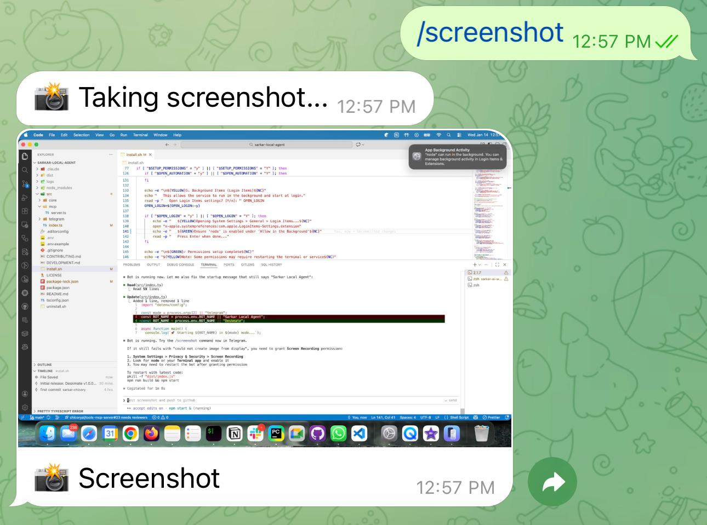
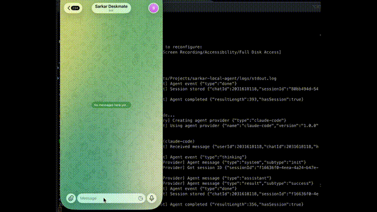
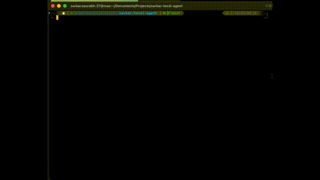
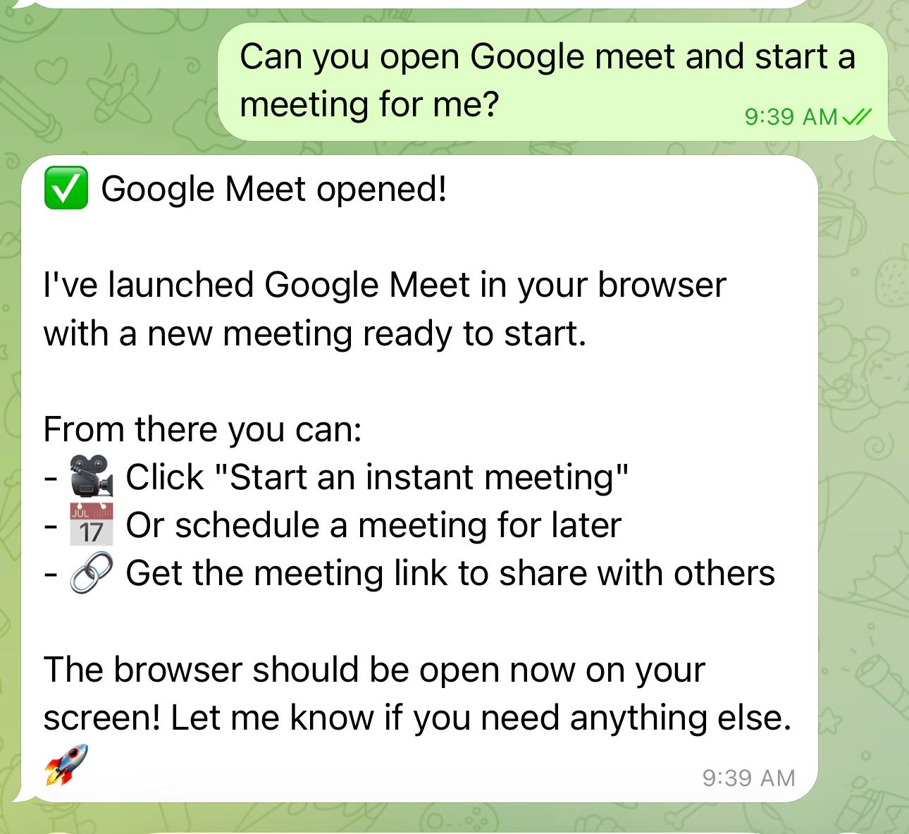

# Deskmate

Control your Local Machine from anywhere using natural language.

<p align="center">
  <a href="LICENSE"></a>
  <a href="#requirements"></a>
  <a href="#requirements"></a>
  <a href="https://discord.com/channels/1467923903597908244/1467926060195778692"></a>
</p>

Deskmate is a local execution agent that lets you control your personal machine using natural language and talks to you on the channels you already use. Deskmate focuses on execution, not autonomy or orchestration. Send a Telegram message from your phone, and it executes on your machine. Supports multiple agent backends — [Claude Code](https://docs.anthropic.com/en/docs/claude-code), [Codex (OpenAI)](https://github.com/openai/codex), [Gemini CLI](https://github.com/google-gemini/gemini-cli), and [OpenCode](https://github.com/opencode-ai/opencode) — with full local tool access, no sandboxed command set, no artificial limits.

A passion project developed, born from a simple goal: staying in creative and developer flow even when I'm not sitting at my desk. Inspired by [gen-shell](https://github.com/sarkarsaurabh27/gen-shell).

[Getting Started](#quick-start) · [Gateway Mode](#gateway-mode) · [Agent Providers](#agent-providers) · [Architecture](#architecture) · [Discord](https://discord.com/channels/1467923903597908244/1467926060195778692)

---

## Demo

<p align="center">
  
</p>

| Telegram Conversation | Installation |
|:---:|:---:|
|  |  |

## How it works

```
Telegram / Discord* / Slack* / ...
            |
            v
  +-------------------+
  |      Gateway      |    auth, sessions, approval routing
  |  (control plane)  |
  +--------+----------+
           |
           v
  +-------------------+
  |   Agent Provider  |    Claude Code | Codex | Gemini | OpenCode
  |   (pluggable)     |    full local tool access
  +-------------------+
           |
           v
     Your Machine
     (executes tasks)
```
*Discord and Slack adapters are planned — see [Adding a new client](#adding-a-new-client).

The Gateway is the control plane. Each messaging platform is a thin I/O adapter. The agent has unrestricted access to your machine (approve-by-default), with optional approval gating for protected folders.

## Responsibility Boundary

Deskmate's responsibility is **execution**.

- It turns intent into concrete system actions
- It does not coordinate other agents

## Highlights

- **Full local access** — the agent can run any command, read/write any file, take screenshots. No artificial 6-tool sandbox.
- **Multi-channel gateway** — Telegram today, Discord/Slack/WhatsApp tomorrow. One Gateway, many clients.
- **Conversation memory** — session continuity across messages. Ask follow-up questions naturally.
- **Multi-agent backends** — ships with Claude Code (default), Codex (OpenAI), Gemini CLI (Google), and OpenCode. Switch with `AGENT_PROVIDER=codex` in `.env`.
- **Approve-by-default** — safe commands auto-approve. Protected folders (Desktop, Documents, etc.) prompt for confirmation via inline buttons.
- **MCP server** — expose your machine as a tool server for Claude Desktop or any MCP client.
- **Skills system** — define reusable multi-step workflows in `skills.json`. Skills can run commands, agent prompts, or other skills. Hot-reloaded on change.
- **Cron scheduler** — schedule recurring jobs (commands, agent queries, or skills) via `crons.json`. Results are delivered to your active chat channels.
- **Health monitoring** — built-in health checks for CPU, memory, disk, agent availability. Accessible via `/health` in Telegram, `deskmate health` on CLI, or the `get_health` MCP tool.
- **Docker container mode** — run the core in Docker with a native sidecar for host commands. Set `INSTALL_MODE=container` and use `docker-compose up`.
- **Runs as service** — launchd (macOS) or systemd (Linux) integration, starts on boot, restarts on crash.
- **Extensible agent layer** — bring your own agent via `registerProvider()`.

## Requirements

- **macOS** (tested on Ventura, Sonoma, Sequoia) or **Linux** (with systemd)
- Windows via [WSL2](https://learn.microsoft.com/en-us/windows/wsl/install)
- Node.js 18+
- One of the supported agent CLIs installed (see [Agent Providers](#agent-providers))
- Telegram account (for Telegram mode)
- API key for your chosen provider (Anthropic, OpenAI, or Google — OpenCode manages its own auth)

### Linux Prerequisites

- **Screenshots:** Install [ImageMagick](https://imagemagick.org/) (`sudo apt install imagemagick`) for screenshot support
- **Service:** systemd with user session support (`systemctl --user`)

### macOS Permissions

The installer guides you through these (macOS only). You can also configure them manually in **System Settings > Privacy & Security**.

| Permission | Purpose |
|------------|---------|
| **Screen Recording** | Take screenshots when requested |
| **Accessibility** | Control system functions |
| **Full Disk Access** | Read/write files in protected locations |
| **Automation** | Control other applications via AppleScript |
| **Background Items** | Run as a background service at login |
| **Folder Access** | Access to Desktop, Documents, Downloads, etc. |

## Quick Start

### Option A: Install from npm (recommended)

```bash
npm install -g @sarkar-ai/deskmate
deskmate init
```

The wizard walks you through everything: API keys, Telegram credentials,
platform permissions, and background service setup. Config is stored in
`~/.config/deskmate/.env`.

After setup, run manually with `deskmate` or let the background service handle it.

### Option B: Install from source (for contributors)

```bash
git clone https://github.com/sarkar-ai-taken/deskmate.git
cd deskmate
npm install --legacy-peer-deps
npm run build
./install.sh          # interactive: configures .env, service, permissions
```

Or use the TypeScript wizard instead of the shell installer:

```bash
cp .env.example .env  # edit with your credentials
npx deskmate init     # or: npm link && deskmate init
```

To reconfigure later: `deskmate init`

## Running Modes

| Mode | Command | Description |
|------|---------|-------------|
| Gateway | `deskmate` | Multi-client gateway (default) |
| MCP | `deskmate mcp` | MCP server for Claude Desktop |
| Both | `deskmate both` | Gateway + MCP simultaneously |
| Sidecar | `deskmate sidecar` | Host sidecar for container mode |

> **Note:** `deskmate telegram` still works but is a deprecated alias that starts the gateway.

## Gateway Mode

The gateway is the default way to run Deskmate. It separates platform I/O from agent logic, so adding a new messaging client doesn't require touching auth, sessions, or the agent layer.

```bash
# Configure multi-client auth
ALLOWED_USERS=telegram:123456,discord:987654321

# Start
deskmate
```

The gateway auto-registers clients based on available env vars. If `TELEGRAM_BOT_TOKEN` is set, Telegram is active. Future clients (Discord, Slack) follow the same pattern.

## Bot Commands

| Command | Description |
|---------|-------------|
| `/start` | Show welcome message |
| `/screenshot` | Take a screenshot and send it |
| `/status` | Show system info and session status |
| `/health` | Show system health and resource metrics |
| `/skill` | List or run a registered skill |
| `/cron` | Show cron job status |
| `/reset` | Clear conversation memory |

## Usage Examples

**System management** — "Show disk usage", "What processes are using the most CPU?", "List all running Docker containers"

**File operations** — "Show me the contents of package.json", "Find all TypeScript files in src/", "Create a new file called notes.txt with today's date"

**Development** — "Run the tests", "What's the git status?", "Show me recent commits"

**Troubleshooting** — "What's using port 8080?", "Show me the last 50 lines of the error log", "Check if nginx is running"

**Visual** — "Take a screenshot", "Show me what's on the screen"

| Taking a Screenshot | Opening Google Meet |
|:---:|:---:|
|  |  |

## MCP Server

The MCP server exposes your machine as a tool server for Claude Desktop or any MCP client.

### Setup with Claude Desktop

Add to `~/Library/Application Support/Claude/claude_desktop_config.json`:

```json
{
  "mcpServers": {
    "deskmate": {
      "command": "node",
      "args": ["/path/to/deskmate/dist/index.js", "mcp"],
      "env": {
        "WORKING_DIR": "/Users/yourname"
      }
    }
  }
}
```

Restart Claude Desktop. You can now ask Claude to interact with your local machine.

### Combined Mode (Gateway + MCP)

Run both with `deskmate both`. MCP handles Claude Desktop requests; the gateway handles Telegram (and future clients), sending approval notifications to your phone so you can approve sensitive operations from anywhere.

### Observability

Deskmate focuses on executing actions safely.

For monitoring agent behavior, resource usage, and failures across
multiple local agents, see **Riva** (local-first agent observability).

## Skills

Skills are reusable multi-step workflows defined in JSON. Place a `skills.json` in your project root or `~/.config/deskmate/skills.json` for global skills. Skills hot-reload when the file changes.

```json
{
  "version": 1,
  "skills": [
    {
      "name": "deploy",
      "description": "Build and deploy the project",
      "parameters": [{ "name": "env", "required": true }],
      "steps": [
        { "type": "command", "command": "npm run build" },
        { "type": "command", "command": "./deploy.sh {{env}}" }
      ]
    }
  ]
}
```

Each step can be a `command` (shell), `prompt` (agent query), or `skill` (nested skill). Run via `/skill deploy env=staging` in Telegram or the `run_skill` MCP tool.

## Cron Jobs

Schedule recurring jobs via `crons.json` (project-local or `~/.config/deskmate/crons.json`).

```json
{
  "version": 1,
  "jobs": [
    {
      "name": "daily-backup",
      "schedule": "0 2 * * *",
      "action": { "type": "command", "command": "tar czf ~/backup.tar.gz ~/Documents" },
      "notify": true
    }
  ]
}
```

Actions can be `command`, `agent_query` (natural language prompt), or `skill`. Set `notify: true` to receive results in your active chat channels. Check status with `/cron` in Telegram or `list_cron_jobs` MCP tool.

## Security

> **Important**: The agent can execute arbitrary commands on your machine. This is by design — the strategy is approve-by-default for read-only operations, with approval gating for protected folders and write operations.

### Built-in protections

| Layer | What it does |
|-------|-------------|
| **User authentication** | Allowlist-based access control via `SecurityManager`. Only users in `ALLOWED_USERS` can interact. Supports per-client auth (`telegram:123`, `discord:456`) and wildcards (`*:*`). |
| **Action approval** | `ApprovalManager` gates sensitive operations. Write commands, file writes, and folder access require explicit human approval with configurable timeouts (default 5 min). |
| **Protected folders** | OS-aware folder protection. Desktop, Documents, Downloads, Pictures, Movies/Videos, Music, and iCloud (macOS) require approval. Session-based caching avoids repeated prompts. |
| **Safe command auto-approval** | Read-only commands (`ls`, `cat`, `git status`, `docker ps`, `node -v`, etc.) auto-approve. Full list in `src/core/approval.ts`. |
| **Command execution limits** | 2-minute timeout and 10 MB output buffer per command. Prevents runaway processes and memory exhaustion. |
| **Session isolation** | Sessions keyed by `clientType:channelId`. 30-minute idle timeout with automatic pruning. Optional disk persistence survives restarts. |
| **Input validation** | MCP tools use Zod schema validation. Telegram callbacks validated via regex patterns. |
| **No open ports** | The bot polls Telegram's servers — no inbound ports exposed. |
| **No sudo by default** | The agent won't use sudo unless you explicitly ask. |
| **Structured logging** | All actions logged with timestamps, context hierarchy, and configurable log levels for audit trails. |
| **Stale message protection** | Telegram client drops pending updates on startup (`drop_pending_updates: true`), preventing replay of messages received while offline. |

### Approval workflow

1. User sends a message that triggers a sensitive operation (e.g., writing to `~/Documents`)
2. `ApprovalManager` checks if the action matches a safe auto-approve pattern
3. If not safe, a pending approval is created with a timeout countdown
4. Approval request is broadcast to all clients with recent activity (last 30 min)
5. User taps Approve/Reject via inline buttons (Telegram) or equivalent
6. Action executes on approval, or is cancelled on rejection/timeout

Set `REQUIRE_APPROVAL_FOR_ALL=true` to gate every operation, including reads.

### Recommendations

- Set `WORKING_DIR` to limit default command scope
- Use `ALLOWED_USERS` for multi-client allowlisting
- Use `ALLOWED_FOLDERS` to pre-approve specific directories
- Review logs regularly (`logs/stdout.log`)
- Keep `.env` secure and never commit it
- Use `REQUIRE_APPROVAL_FOR_ALL=true` if you want to approve every operation

### Execution Philosophy

Deskmate follows an **approve-by-default, visible-by-design** model.

- Read-only operations are auto-approved
- Sensitive operations require explicit confirmation
- All actions are logged locally

The goal is speed without hidden behavior.

## Non-goals

Deskmate is intentionally not:
- A multi-agent orchestration framework
- A cloud-hosted control plane
- A long-running autonomous system

These constraints are deliberate.

## Agent Providers

Deskmate supports multiple agent backends. Set `AGENT_PROVIDER` in your `.env` or select one during `deskmate init`.

| Provider | Binary | Env Var | Install |
|----------|--------|---------|---------|
| **Claude Code** (default) | `claude` | `ANTHROPIC_API_KEY` | [docs.anthropic.com](https://docs.anthropic.com/en/docs/claude-code) |
| **Codex** (OpenAI) | `codex` | `OPENAI_API_KEY` | [github.com/openai/codex](https://github.com/openai/codex) |
| **Gemini CLI** (Google) | `gemini` | `GEMINI_API_KEY` | [github.com/google-gemini/gemini-cli](https://github.com/google-gemini/gemini-cli) |
| **OpenCode** | `opencode` | *(manages own auth)* | [github.com/opencode-ai/opencode](https://github.com/opencode-ai/opencode) |

```bash
# Switch provider
AGENT_PROVIDER=codex
OPENAI_API_KEY=sk-...

# Or use the wizard
deskmate init
```

Only the API key matching your selected provider is required. Keys for other providers are preserved in `.env` if you switch back.

## Architecture

```
src/
├── core/
│   ├── agent/
│   │   ├── types.ts              # AgentProvider interface
│   │   ├── factory.ts            # Provider factory + registerProvider()
│   │   └── providers/
│   │       ├── claude-code.ts    # Claude Code SDK (default)
│   │       ├── base-cli.ts       # Base class for CLI-spawned providers
│   │       ├── codex.ts          # Codex (OpenAI)
│   │       ├── gemini.ts         # Gemini CLI (Google)
│   │       └── opencode.ts       # OpenCode
│   ├── approval.ts               # Approval manager (auto-approve + manual)
│   ├── executor.ts               # Command execution, file I/O, screenshots
│   ├── executor-factory.ts       # Creates local or remote executor
│   ├── executor-interface.ts     # IExecutor interface
│   ├── remote-executor.ts        # Executor that delegates to sidecar
│   ├── health.ts                 # Health monitoring (CPU, memory, disk, agent)
│   ├── skills/                   # Skills system
│   │   ├── types.ts              # Skill definition schema (Zod)
│   │   ├── registry.ts           # Loads skills.json, hot-reloads on change
│   │   └── executor.ts           # Runs multi-step skill workflows
│   ├── cron/                     # Cron scheduler
│   │   ├── types.ts              # Cron job definition schema (Zod)
│   │   └── scheduler.ts          # node-cron based job runner
│   └── logger.ts                 # Structured logging
├── gateway/
│   ├── types.ts                  # MessagingClient, MessageHandler interfaces
│   ├── gateway.ts                # Central coordinator
│   ├── security.ts               # Multi-client allowlist auth
│   └── session.ts                # Session manager (composite keys, idle pruning)
├── clients/
│   └── telegram.ts               # Telegram adapter (grammY)
├── sidecar/                      # Host sidecar for container mode
│   ├── server.ts                 # Express server exposing executor over HTTP
│   └── cli.ts                    # Sidecar CLI entry point
└── mcp/
    └── server.ts                 # MCP server
```

**Agent layer** — ships with four providers: Claude Code (via `@anthropic-ai/claude-agent-sdk`), Codex, Gemini CLI, and OpenCode. The three non-Claude providers extend `BaseCliProvider`, which handles subprocess spawning and stdout streaming. Custom agent providers can be registered via `registerProvider()`.

**Gateway layer** — central coordinator handling auth (`SecurityManager`), sessions (`SessionManager`), agent orchestration, approval routing, and screenshot delivery. Platform adapters implement the `MessagingClient` interface and do only I/O.

### Adding a new client

1. Create `src/clients/discord.ts` implementing `MessagingClient` (see `src/gateway/types.ts`)
2. Add `DISCORD_BOT_TOKEN` to `.env`
3. Add `discord:userId` to `ALLOWED_USERS`
4. Register in the gateway startup: `gateway.registerClient(new DiscordClient(token))`

No changes to Gateway, SecurityManager, SessionManager, or the agent layer.

### Bringing your own agent

```typescript
import { AgentProvider, registerProvider } from "./core/agent";

class MyAgent implements AgentProvider {
  readonly name = "my-agent";
  readonly version = "1.0.0";
  // implement query(), queryStream(), isAvailable()
}

registerProvider("my-agent", MyAgent);
// then set AGENT_PROVIDER=my-agent in .env
```

## CLI Commands

| Command | Description |
|---------|-------------|
| `deskmate` | Start the gateway (default mode) |
| `deskmate init` | Interactive setup wizard |
| `deskmate status` | Show service status and config validation |
| `deskmate health` | Show system health and resource metrics |
| `deskmate logs` | Tail stdout.log (`--stderr` for error log) |
| `deskmate restart` | Restart the background service |
| `deskmate doctor` | Run diagnostic checks |
| `deskmate sidecar` | Start the host sidecar (container mode) |

## Docker / Container Mode

Run Deskmate in a Docker container with a native sidecar handling host-level commands (screenshots, file access).

```bash
# Set install mode
INSTALL_MODE=container

# Start the sidecar on the host
deskmate sidecar

# Start the container
docker-compose up -d
```

The `Dockerfile` and `docker-compose.yml` are included in the package. The sidecar exposes a local HTTP API that the containerized core uses to execute commands on the host.

## Service Management

### macOS (launchd)

```bash
# View logs
tail -f logs/stdout.log
tail -f logs/stderr.log

# Stop the service
launchctl unload ~/Library/LaunchAgents/com.deskmate.service.plist

# Start the service
launchctl load ~/Library/LaunchAgents/com.deskmate.service.plist

# Check status
launchctl list | grep deskmate
```

### Linux (systemd)

```bash
# View logs
tail -f logs/stdout.log
journalctl --user -u deskmate.service -f

# Stop / start / restart
systemctl --user stop deskmate.service
systemctl --user start deskmate.service
systemctl --user restart deskmate.service

# Check status
systemctl --user status deskmate.service
```

### Uninstall

```bash
./uninstall.sh
```

## Troubleshooting

**Bot not responding?**
1. Check logs: `tail -f logs/stderr.log`
2. Verify your `ALLOWED_USERS` includes your Telegram ID (e.g. `telegram:123456`)
3. Ensure your agent CLI is installed (e.g. `which claude`, `which codex`, `which gemini`, `which opencode`)
4. Run `deskmate doctor` to diagnose configuration issues

**Commands timing out?**
- Default timeout is 2 minutes
- Long-running commands may need adjustment

**Machine going to sleep?**
- macOS: Run `./install.sh` to configure sleep prevention, or manually: `sudo pmset -c sleep 0`
- Linux: The systemd service uses idle inhibitor. Check your desktop environment's power settings.

**Permission denied errors? (macOS)**
- Re-run `./install.sh` and go through the permissions setup
- Or manually grant permissions in System Settings > Privacy & Security

**Screenshots not working?**
- macOS: Grant Screen Recording permission in System Settings > Privacy & Security > Screen Recording
- Linux: Install ImageMagick (`sudo apt install imagemagick`)
- Restart the service after making changes

## Future Work / Help Wanted

**Additional messaging clients** — the gateway architecture is ready. We'd welcome:
- `discord` — Discord bot via discord.js
- `slack` — Slack app via Bolt SDK
- `whatsapp` — WhatsApp via the Business API

**Background job handling** — the current `launchd` (macOS) + `systemd` (Linux) approach works but could be improved for different device types (always-on Mac Mini vs MacBook, headless Linux servers).

Open an issue to discuss your approach.

## Contributing

We welcome contributions! See [CONTRIBUTING.md](CONTRIBUTING.md) for guidelines.

See [DEVELOPMENT.md](DEVELOPMENT.md) for architecture details and local setup.

## License

MIT License — see [LICENSE](LICENSE) for details.

## Acknowledgments

- [Claude Agent SDK](https://docs.anthropic.com/en/docs/claude-code/agent-sdk) — default agent runtime
- [Codex](https://github.com/openai/codex) — OpenAI agent backend
- [Gemini CLI](https://github.com/google-gemini/gemini-cli) — Google agent backend
- [OpenCode](https://github.com/opencode-ai/opencode) — OpenCode agent backend
- [grammY](https://grammy.dev/) — Telegram bot framework
- [@modelcontextprotocol/sdk](https://github.com/modelcontextprotocol/sdk) — MCP support

---

## Community

- [Discord](https://discord.com/channels/1467923903597908244/1467926060195778692) — join the community, ask questions, share your setup

## Share

If you find Deskmate useful, feel free to share:

- [Share on X](https://x.com/intent/post?text=Running%20real%20system%20actions%20with%20a%20local-first%20AI%20agent.%20Deskmate%20lets%20you%20control%20your%20machine%20using%20natural%20language.&url=https%3A%2F%2Fgithub.com%2Fsarkar-ai-taken%2Fdeskmate&via=sarkar_ai)
- [Post to Hacker News](https://news.ycombinator.com/submitlink?u=https%3A%2F%2Fgithub.com%2Fsarkar-ai-taken%2Fdeskmate&t=Deskmate%3A%20A%20local-first%20AI%20agent%20for%20executing%20real%20system%20actions)
